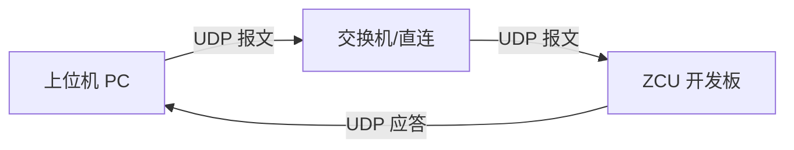

---

# 上位机 -ZCU 以太网通信功能接口描述文档（UDP 版）

| 文档编号 | ETH-COMM-UDP-001 | 版本号 | V1.1 |
| :--- | :--- | :--- | :--- |
| **编制日期** | 2026-03-04 | **密级** | 内部公开 |
| **编制人** | [付宝军] | **审核人** | [xxx] |

---

## 1. 引言 (Introduction)

### 1.1 背景
为验证上位机与下游 ZCU 硬件平台的以太网通信能力，需在上位机界面中新增以太网通信控件。考虑到演示场景对实时性的要求及简化连接流程，本次通信采用 **UDP (User Datagram Protocol)** 协议。

### 1.2 目的
本文档定义了上位机新增控件的功能逻辑、UDP 通信协议格式及数据接口，用于指导上位机软件开发及 ZCU 端固件开发，确保双方基于无连接模式下的通信一致。

### 1.3 适用范围
- 上位机软件（Windows）
- ZCU 端嵌入式软件（Baremetal）
- 网络通信层（UDP/IP）

---

## 2. 系统架构 (System Architecture)

### 2.1 通信拓扑


### 2.2 通信角色
- **发送端 (Sender)**: 上位机。负责构造 UDP 数据包发送至 ZCU 指定端口，并监听本地端口接收应答。
- **接收端 (Receiver)**: ZCU。负责绑定端口监听数据包，解析后执行动作，并可选返回应答。

### 2.3 网络配置建议
- **IP 地址**: 需在同一网段（例如：PC `192.168.1.10`, ZCU `192.168.1.100`）。
- **目标端口 (ZCU)**: `5000` (ZCU 监听端口)。
- **本地端口 (PC)**: `5001` (PC 监听应答端口，可动态分配)。
- **传输协议**: **UDP**。

---

## 3. 上位机界面控件需求 (UI Requirements)

在现有界面中增加一个**“以太网 UDP 通信控制”**面板，包含以下元素：

| 控件名称 | 类型 | 功能描述 | 默认状态 |
| :--- | :--- | :--- | :--- |
| `txt_TargetIP` | 输入框 | 输入 ZCU 的目标 IP 地址 | 192.168.1.100 |
| `txt_TargetPort` | 输入框 | 输入 ZCU 监听端口号 | 5000 |
| `txt_LocalPort` | 输入框 | 输入本机监听端口 (接收 ACK) | 5001 |
| `btn_InitSocket` | 按钮 | 初始化本地 UDP Socket (绑定端口) | 显示“初始化” |
| `lbl_Status` | 标签 | 显示通信活跃状态 (基于最近接收时间) | 灰色“未初始化” |
| `cmb_Command` | 下拉框 | 选择要发送的演示指令 | 请选择指令 |
| `btn_Send` | 按钮 | 发送 UDP 数据包 | 禁用 (初始化后启用) |
| `chk_WaitAck` | 复选框 | 是否等待 ZCU 应答 (超时提示) | 勾选 |
| `txt_Log` | 多行文本 | 显示发送记录及 ZCU 返回的日志 | 空 |

### 3.1 交互逻辑
1. **初始化**: 点击 `btn_InitSocket`，上位机绑定本地 UDP 端口，准备收发。状态变为“就绪”。
2. **发送**: 选择指令后点击 `btn_Send`，构造 UDP 数据包发送至目标 IP:Port。
3. **接收**: 异步监听本地端口，若收到 ZCU 返回的 UDP 包，解析并打印至 `txt_Log`，更新 `lbl_Status` 为“通信正常”。
4. **超时处理**: 若勾选 `chk_WaitAck` 且发送后 2 秒内未收到应答，在 Log 中提示“未收到应答 (可能丢包)"。

---

## 4. 通信协议定义 (Protocol Definition)

由于 UDP 不保证可靠交付，协议头中增加 **序列号 (Sequence Number)** 以便应用层检测丢包或重复包。数据载荷仍采用 **JSON 格式** 以便阅读和调试。

### 4.1 数据包结构 (UTF-8 JSON)
```json
{
    "header": {
        "seq": 1001,              // 自增序列号，用于检测丢包
        "timestamp": 1698372000,  // 发送时间戳
        "source": "PC_HOST"       // 来源标识
    },
    "body": {
        "cmd_code": 101,          // 指令码
        "parameters": {}          // 指令参数
    }
}
```

### 4.2 指令集定义 (Command Codes)

| 指令码 (cmd_code) | 指令名称 | 描述 | 参数 (parameters) | ZCU 动作 |
| :--- | :--- | :--- | :--- | :--- |
| **101** | `CMD_START_STOP` | 切换上下车模式 | `{"Interface_id": 0}` | 翻转指定接口 |
| **102** | `CMD_GET_STATUS` | 查询系统状态 | `{}` | 返回 ZCU 运行信息 |
| **103** | `CMD_PING` | 心跳检测 | `{}` | 仅返回 ACK，不执行动作 |
| **200** | `RSP_ACK` | 通用应答 | `{"result": "OK", "orig_seq": 1001}` | 上位机接收到的返回包 |

### 4.3 通信示例

**上位机发送 (Request):**
```json
{
    "header": { "seq": 10, "timestamp": 1698372000, "source": "PC_HOST" },
    "body": { "cmd_code": 101, "parameters": { "led_id": 0 } }
}
```

**ZCU 返回 (Response):**
*(注意：UDP 响应需发送回上位机的 IP 和 本地端口)*
```json
{
    "header": { "seq": 10, "timestamp": 1698372001, "source": "ZCU_TARGET" },
    "body": { "cmd_code": 200, "parameters": { "result": "OK", "msg": "LED Toggled" } }
}
```

---

## 5. 接口函数定义 (API Definition)

上位机软件内部需实现以下核心类/接口（基于 UDP Socket）：

### 5.1 类名：`UdpCommunicationManager`

| 函数名 | 输入参数 | 返回值 | 描述 |
| :--- | :--- | :--- | :--- |
| `Initialize` | `local_port: int` | `bool` | 创建 UDP Socket 并绑定本地端口 |
| `SetTarget` | `ip: string, port: int` | `void` | 设置目标 ZCU 的地址信息 |
| `SendPacket` | `data: JSON` | `bool` | 调用 sendto 发送数据，返回发送字节数 |
| `ReceiveLoop` | `timeout_ms: int` | `JSON` | 非阻塞接收数据，超时返回空 |
| `SetCallback` | `func: OnMessageReceived` | `void` | 注册接收回调函数，用于更新 UI |

### 5.2 关键逻辑说明
- **SendPacket**: 无需建立连接，直接指定目标 IP 发送。
- **ReceiveLoop**: 由于 UDP 无连接，需持续监听端口。建议在独立线程中运行 `recvfrom`。
- **序列号管理**: 每次发送 `seq` 加 1；收到应答时比对 `orig_seq` 确认是否为本次请求的响应。

---

## 6. ZCU 端处理逻辑 (ZCU Logic)

ZCU 端需运行一个 UDP Server 守护进程，逻辑如下：

1. **创建 Socket**: `socket(AF_INET, SOCK_DGRAM, 0)`。
2. **绑定地址**: `bind()` 到指定端口 (如 5000)，地址设为 `INADDR_ANY`。
3. **循环接收**:
   - 调用 `recvfrom()` 阻塞等待数据。
   - 获取发送方的 `sockaddr_in` 结构（包含上位机 IP 和端口）。
4. **解析与执行**:
   - 解析 JSON，提取 `cmd_code`。
   - 执行对应硬件操作（如 GPIO 翻转）。
5. **构造应答**:
   - 构造包含 `orig_seq` 的 JSON 应答包。
   - 调用 `sendto()`，**目标地址填写步骤 3 中获取的上位机 IP 和端口**。
6. **异常**: 若 JSON 解析失败，可选择不回应或返回错误包（避免广播风暴）。

---

## 7. 异常处理与 UDP 特性 (Error Handling & UDP Specifics)

| 异常场景 | 现象 | 处理建议 |
| :--- | :--- | :--- |
| **数据包丢失** | 上位机发送后未收到 ACK | 应用层实现简易重传机制（如最多重试 3 次） |
| **数据包乱序** | 后发的包先到 | 依赖 `header.seq` 序列号处理业务逻辑 |
| **目标不可达** | 发送失败 (ICMP Port Unreachable) | 捕获 Socket 错误，提示“目标端口未监听” |
| **大数据包** | 数据超过 MTU (通常 1500 字节) | 限制 JSON 长度，或实现应用层分片 (本演示不涉及) |

---

## 8. 测试与验收标准 (Testing & Validation)

1. **连通性测试**:
   - 上位机初始化 Socket 成功。
   - 使用 Wireshark 抓包，能看到上位机发出的 UDP 包到达 ZCU。
2. **功能演示**:
   - 发送 `CMD_LED_TOGGLE`，ZCU 板载 LED 灯状态发生物理改变。
   - 上位机 Log 区能收到 ZCU 返回的 JSON 应答，且 `seq` 号匹配。
3. **丢包模拟**:
   - 在网络拥堵环境下（或软件模拟），验证上位机是否有“未收到应答”的提示。
4. **压力测试**:
   - 连续快速发送 1000 个 UDP 包，ZCU 端不应崩溃，上位机统计接收到的 ACK 数量（允许少量丢包）。

---

